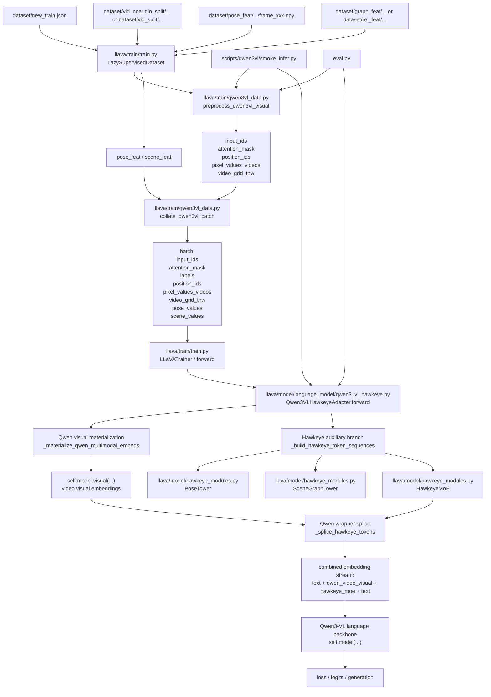

# Hawkeye Current Architecture and Data Flow

## Scope

This document describes the current code architecture after the Qwen-Hawkeye
migration updates. It focuses on:

1. input and preprocessing
2. video / pose / scene encoding
3. Hawkeye GNN + MoE scene enhancement
4. Qwen3-VL fusion path
5. training and inference entry points

It also names the file used at each step so the pipeline can be audited quickly.

---

## End-to-End Framework

---

## Training Data Flow

### Step 1: Dataset assembly

File:

- `llava/train/train.py`

Main entry:

- `LazySupervisedDataset`

Responsibilities:

1. read conversation JSON from `dataset/new_train.json`
2. resolve video path
3. load pose feature from `dataset/pose_feat/...`
4. load scene feature from `dataset/graph_feat/...` or `dataset/rel_feat/...`
5. pad or truncate pose / scene features to 5 frames
6. call Qwen visual preprocessing when the model path is Qwen3-VL

Outputs per sample:

1. `input_ids`
2. `attention_mask`
3. `position_ids`
4. `labels`
5. `pixel_values_videos` or `pixel_values`
6. `video_grid_thw` or `image_grid_thw`
7. `pose_feat`
8. `scene_feat`

---

## Qwen Visual Preprocessing

File:

- `llava/train/qwen3vl_data.py`

Main entries:

1. `preprocess_qwen3vl_visual`
2. `collate_qwen3vl_batch`
3. `get_rope_index_3`

Responsibilities:

1. build Qwen chat-template messages from conversation + media placeholder
2. call `processor.apply_chat_template(...)`
3. compute `position_ids` for Qwen3-VL mRoPE layout
4. build assistant-only `labels`
5. collate multimodal tensors into one training batch

Batch interface emitted to the model:

1. `input_ids`
2. `attention_mask`
3. `labels`
4. `position_ids`
5. `pixel_values_videos`
6. `video_grid_thw`
7. `pose_values`
8. `scene_values`

---

## Hawkeye Auxiliary Branch

File:

- `llava/model/hawkeye_modules.py`

Main components:

1. `PoseTower`
2. `SceneGraphTower`
3. `HawkeyeMoE`
4. `build_pose_tower`
5. `build_scene_tower`
6. `build_moe`

### Pose branch

Input:

- `pose_values` with shape approximately `(T, 17, 5)`

Flow:

1. flatten per frame to pose dimension
2. project to Qwen hidden size

### Scene branch

Input:

- `scene_values` with shape approximately `(T, 353)`

Flow:

1. split relation / subject / object logits
2. build a scene graph
3. run GTN-style message passing
4. project graph tokens to Qwen hidden size

### MoE branch

Input:

- encoded pose tokens
- encoded scene tokens

Flow:

1. concatenate pose and scene tokens
2. compute routing weights
3. run expert resampler blocks
4. emit Hawkeye scene-enhanced token sequence

Output:

- `hawkeye_tokens`

---

## Qwen-Hawkeye Fusion Path

File:

- `llava/model/language_model/qwen3_vl_hawkeye.py`

Main class:

- `Qwen3VLHawkeyeAdapter`

Main methods:

1. `encode_poses`
2. `encode_scenes`
3. `moe_route`
4. `_materialize_qwen_multimodal_embeds`
5. `_build_hawkeye_token_sequences`
6. `_splice_hawkeye_tokens`
7. `_prepare_qwen_hawkeye_inputs`
8. `forward`
9. `generate`

### Important current fusion semantics

The wrapper now does the fusion in this order:

1. start from `input_ids`
2. call Qwen visual module explicitly to materialize video visual embeddings
3. scatter those visual embeddings into the `video_token_id` positions
4. build Hawkeye MoE tokens from `pose_values + scene_values`
5. insert Hawkeye tokens immediately after the contiguous video token span
6. send the already-combined `inputs_embeds` sequence to the Qwen language backbone

This is the current closest Qwen equivalent of the old LLaVA
`prepare_inputs_labels_for_multimodal` replacement behavior.

### Why this matters

The earlier Qwen adapter only injected Hawkeye tokens after the placeholder span
while still leaving video processing entirely inside the backbone.
The current version explicitly materializes the Qwen video visual embeddings first,
so the final external embedding stream is effectively:

`[text ; qwen_video_visual_embeds ; hawkeye_moe_tokens ; text]`

instead of:

`[text ; video placeholder handled later ; hawkeye only]`

---

## Legacy LLaVA Path

File:

- `llava/model/llava_arch.py`

Main method:

- `prepare_inputs_labels_for_multimodal`

Legacy semantics:

1. encode video with the old video tower
2. encode pose
3. encode scene graph
4. generate MoE tokens
5. concatenate `video_features + moe_features`
6. replace the single VIDEO placeholder with the whole multimodal sequence

This remains the reference implementation for the original paper path.

---

## Video token organization isomorphism (占位符处「视频特征 + 场景增强 MoE」拼接)

Both the LLaVA path and the Qwen3-VL path now implement the same semantic at the placeholder:

- **LLaVA** (`llava_arch.prepare_inputs_labels_for_multimodal`):  
  `cur_X_features = torch.cat((X_features_video[i], X_moe_feat), dim=0)` and replace the single VIDEO placeholder with this block. So the placeholder is **[video tokens] + [MoE tokens]**.

- **Qwen3-VL** (`qwen3_vl_hawkeye._prepare_qwen_hawkeye_inputs`):  
  1. `_materialize_qwen_multimodal_embeds` scatters **video embeddings** into positions where `input_ids == video_token_id`.  
  2. `_splice_hawkeye_tokens` inserts **Hawkeye MoE token block** immediately after the last video token (`insert_at = spans[-1][1]`), so the sequence is `[...][video_embeds][moe_embeds][...]`.  
  So the placeholder region is again **[video features] + [scene-enhanced MoE]**.

Conclusion: the code **does** implement video token organization isomorphism: at the placeholder, both paths use the concatenation of video features and scene-enhanced MoE tokens, matching the original Hawkeye design.

---

## Inference Entry Points

### Smoke inference

File:

- `scripts/qwen3vl/smoke_infer.py`

Responsibilities:

1. load base or adapter checkpoint
2. preprocess one video sample with Qwen chat template
3. attach optional pose / scene features
4. print tensor shapes
5. call `model.generate(...)`

### Evaluation

File:

- `eval.py`

Responsibilities:

1. iterate dataset folders
2. load pose / scene npy files
3. preprocess Qwen input
4. call Qwen-Hawkeye generation
5. save CSV outputs

---

## Save and Load Layout

Files:

1. `llava/model/builder.py`
2. `llava/model/language_model/qwen3_vl_hawkeye.py`
3. `llava/train/train.py`

Expected Qwen-Hawkeye checkpoint outputs:

1. `adapter_model.*`
2. `adapter_config.json`
3. `non_lora_trainables.bin`
4. `hawkeye_config.json`
5. tokenizer files
6. processor files

Runtime load rule:

1. base-only run:
   `model_path == model_base == Qwen3-VL-8B-Instruct`
2. adapter run:
   `model_path = checkpoint dir`
   `model_base = Qwen3-VL-8B-Instruct`

---

## File Map

### Core model files

1. `llava/model/hawkeye_modules.py`
2. `llava/model/language_model/qwen3_vl_hawkeye.py`
3. `llava/model/llava_arch.py`
4. `llava/model/builder.py`

### Training files

1. `llava/train/train.py`
2. `llava/train/qwen3vl_data.py`
3. `scripts/qwen3vl/train_debug.sh`
4. `scripts/qwen3vl/train_lora.sh`

### Inference files

1. `scripts/qwen3vl/smoke_infer.py`
2. `eval.py`
3. `scripts/qwen3vl/eval_full.sh`

### Data locations

1. `dataset/new_train.json`
2. `dataset/vid_noaudio_split/...`
3. `dataset/vid_split/...`
4. `dataset/pose_feat/...`
5. `dataset/graph_feat/...`
6. `dataset/rel_feat/...`

---

## Practical Review Summary

### What is now correct

1. Qwen path still uses the Hawkeye-specific `pose -> scene graph -> MoE -> splice`
   enhancement chain.
2. Qwen visual embeddings are materialized before Hawkeye token splice.
3. Qwen wrapper now exposes a `prepare_inputs_labels_for_multimodal`-style
   compatibility entry so training and inference logic can be compared against
   the legacy path more directly.
4. Qwen supervision masking no longer depends on a hard-coded assistant token id;
   it is derived from chat-template prefix lengths.

### Current shared-contract status

1. `llava/model/hawkeye_modules.py` is now closer to the original Hawkeye
   contract:
   - `PoseTower` keeps the original per-frame pose projection behavior.
   - `SceneGraphTower` uses the original GTN-style graph construction and
     output contract.
   - `HawkeyeMoE` restores the original router contract:
     `sigmoid -> normalize -> expert weighting`.
2. Qwen path still differs from legacy Hawkeye in one structural sense:
   Qwen visual embeddings are first materialized by the Qwen backbone and then
   Hawkeye tokens are inserted into that embedding stream. This is the intended
   Qwen-compatible equivalent of the original placeholder replacement path.

### What still needs runtime verification

1. exact visual encoder call signature on the target server environment
2. full smoke generation on a real video sample with real `pose/scene` features
3. debug training for 2 steps with the restored shared Hawkeye contract
4. checkpoint reload after LoRA + `non_lora_trainables.bin`
5. evaluation CSV stability on a real IASDig test folder
