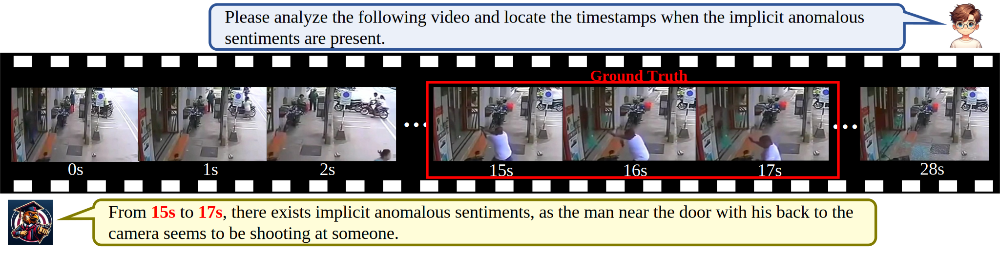

<h2 align="center"> <a href="https://openreview.net/pdf?id=ys3V4jiENk">Hawkeye: Discovering and Grounding Implicit Anomalous Sentiment in Recon-videos via Scene-enhanced Video Large Language Model</a></h2>
<h5 align="center"> If you like our project, please give us a star ⭐ on GitHub for latest update.  </h2>



This repository contains the official implementation of our work in ACM MM 2024. More details can be viewed in our paper. [[PDF]](https://openreview.net/pdf?id=ys3V4jiENk)

## Abstract

In real-world recon-videos such as surveillance and drone reconnaissance videos, commonly used explicit language, acoustic and facial expressions information is often missing. However, these videos are always rich in anomalous sentiments (e.g., criminal tendencies), which urgently requires the implicit scene information (e.g., actions and object relations) to fast and precisely identify these anomalous sentiments. Motivated by this, this paper proposes a new chat-paradigm Implicit anomalous sentiment Discovering and grounding (IasDig) task, aiming to interactively, fast discovering and grounding anomalous sentiments in recon-videos via leveraging the implicit scene information (i.e., actions and object relations). Furthermore, this paper believes that this IasDig task faces two key challenges, i.e., scene modeling and scene balancing. To this end, this paper proposes a new Scene-enhanced Video Large Language Model named Hawkeye, i.e., acting like a raptor (e.g., a Hawk) to discover and locate prey, for the IasDig task. Specifically, this approach designs a graph-structured scene modeling module and a balanced heterogeneous MoE module to address the above two challenges, respectively. Extensive experimental results on our constructed scene-sparsity and scene-density IasDig datasets demonstrate the great advantage of Hawkeye to IasDig over the advanced Video-LLM baselines, especially on the metric of false negative rates. This justifies the importance of the scene information for identifying implicit anomalous sentiments and the impressive practicality of Hawkeye for real-world applications.

## Dependencies

You can set up the environments by using `conda env create -f environment.yml`.

## Training Pipeline

### Dataset Preparation

1. Prepare [TSL-300](https://github.com/nku-zhichengzhang/TSL300) dataset.

2. Prepare [UCF-Crime](https://github.com/WaqasSultani/AnomalyDetectionCVPR2018) dataset.

3. Split the videos into frames, extract action features and object-relation features with [HigherHRNet](https://github.com/HRNet/HigherHRNet-Human-Pose-Estimation) and [RelTR](https://github.com/yrcong/RelTR).
4. Place the features inside the `dataset` folder.
   
    - Please ensure the data structure is as below.

```
├── dataset
   └── vid_split
       ├── 1_Ekman6_disgust_3
           ├── 1.mp4
           ├── 2.mp4
           └── ...
       ├── Abuse028_x264
           ├── 1.mp4
           ├── 2.mp4
           └── ...
   └── pose_feat
       ├── 1_Ekman6_disgust_3
           ├── frame_1.npy
           ├── frame_2.npy
           └── ...
       ├── Abuse028_x264
           ├── frame_1.npy
           ├── frame_2.npy
           └── ...
   └── rel_feat
         ├── 1_Ekman6_disgust_3
              ├── frame_1.npy
              ├── frame_2.npy
              └── ...
         ├── Abuse028_x264
              ├── frame_1.npy
              ├── frame_2.npy
              └── ...
```

### Model checkpoint preparation
Original Hawkeye route:
1. Download the pretrained vicuna-v1.5 model from [Haggingface](https://huggingface.co/lmsys/vicuna-7b-v1.5/tree/main) and place it in the `lmsys` folder.
2. Download the pretrained LanguageBind model from [LanguageBind](https://huggingface.co/LanguageBind) and place it in the `LanguageBind` folder.
3. Keep the original Video-LLaVA projector checkpoint if you run the legacy `scripts/v1_5/*` pipeline.

Qwen-Hawkeye migration route:
1. Place `Qwen3-VL-8B-Instruct` under `models/`.
2. Keep pose features under `dataset/pose_feat/...`.
3. Keep scene features under either `dataset/graph_feat/...` or `dataset/rel_feat/...`.
4. The old `Vicuna + LanguageBind + Video-LLaVA` stack is not required if you only run `scripts/qwen3vl/*`.

See `QWEN3VL_MIGRATION_README.md` for the current migration status, workflow, and known gaps relative to the original paper code.

### Training
```commandline
$ bash scripts/v1_5/finetune_lora_a100.sh
```
After training, the checkpoint will be saved in the `output_folder` folder.


## Model Zoo
<table>
    <tr>
        <td>Metric</td>
        <td>FNRs</td>
        <td>F2</td>
        <td>mAP@ 0.1</td>
        <td>mAP@ 0.2</td>
        <td>mAP@ 0.3</td>
        <td>Url</td>
    </tr>
    <tr>
        <td>On TSL Dataset</td>
        <td>35.82</td>
        <td>38.09</td>
        <td>35.24</td>
        <td>21.21</td>
        <td>14.71</td>
        <td><a href="https://drive.google.com/drive/folders/1_BSovDpZa7F73vnU9uNxu9etQasJb2ri?usp=sharing">Google drive</a></td>
    </tr>
    <tr>
        <td rowspan="2">On UCF-Crime Dataset</td>
        <td rowspan="2">45.66</td>
        <td rowspan="2">45.03</td>
        <td rowspan="2">34.41</td>
        <td rowspan="2">19.22</td>
        <td rowspan="2">12.1</td>
        <td rowspan="2"><a href="https://drive.google.com/drive/folders/1_BSovDpZa7F73vnU9uNxu9etQasJb2ri?usp=sharing">Google drive</a></td>
    </tr>
</table>


## Evaluation
You can evaluate the model by running the command below.
```commandline
python3 eval.py
```

## Work Archive (2026-03-18)

This section records the data-prep migration and extraction status in this workspace.

### What was done

1. Keep `dataset/new_train.json` unchanged as the source-of-truth.
2. Add clip materialization script that follows JSON paths and supports both datasets:
     - `scripts/materialize_clips_from_new_train.py`
     - source search order: `dataset/TSL-300/vid/train/*` and `dataset/UCF-Crime/<Class>/*`
3. Add/upgrade real feature extraction scripts:
     - `scripts/extract_pose_hrnet.py` (HigherHRNet)
     - `scripts/extract_scene_reltr.py` (RelTR)
4. Fix a pose parsing issue for mixed output shapes from HigherHRNet parser.
5. Add resumable progress state for pose extraction:
     - default state file: `<output-root>/_resume_pose.json`
     - custom state file supported via `--resume-state`
6. Batch defaults are now set to `24` for both pose and scene scripts.

### Current status snapshot (real workspace state)

- Clip materialization for `new_train.json`: complete (`missing_source_videos=0` in latest full run).
- Pose extraction is running in background (observed process exists during latest check).
- Latest observed counters at check time:
    - `dataset/pose_feat/train/*/frame_*.npy`: `2603`
    - `dataset/rel_feat/train/*/frame_*.npy`: `1`
    - pose resume state file exists: `dataset/pose_feat/train_resume_state.json`
    - last observed `next_task_index`: `2603`

Note: these counters are time-sensitive and will increase while extraction keeps running.

### Commands used in this workspace

#### 1) Materialize clips from JSON paths

```powershell
$env:PATH="G:\project_space\my_hawkeye\Hawkeye\_bin;" + $env:PATH
& "D:\anaconda3\envs\qwen3vl\python.exe" scripts/materialize_clips_from_new_train.py `
    --json-path dataset/new_train.json `
    --tsl-root dataset/TSL-300 `
    --ucf-root dataset/UCF-Crime `
    --output-root dataset/vid_noaudio_split/train_new
```

#### 2) Pose extraction (quality-preserving, resumable, batch=24 default)

```powershell
$env:PYTHONPATH="G:\project_space\my_hawkeye\Hawkeye\_pydeps"
& "D:\anaconda3\envs\qwen3vl\python.exe" scripts/extract_pose_hrnet.py `
    --json-path dataset/new_train.json `
    --video-root dataset/vid_noaudio_split/train_new `
    --output-root dataset/pose_feat/train `
    --hrnet-root HigherHRNet-Human-Pose-Estimation `
    --hrnet-cfg HigherHRNet-Human-Pose-Estimation/experiments/coco/higher_hrnet/w32_512_adam_lr1e-3.yaml `
    --hrnet-ckpt HigherHRNet-Human-Pose-Estimation/pose_higher_hrnet_w32_512.pth `
    --device cuda `
    --batch-size 24 `
    --resume-state dataset/pose_feat/train_resume_state.json
```

Resume after interruption: run the same command again.

Force restart from beginning:

```powershell
... scripts/extract_pose_hrnet.py ... --reset-resume
```

#### 3) Scene extraction (batch=24 default)

```powershell
& "D:\anaconda3\envs\qwen3vl\python.exe" scripts/extract_scene_reltr.py `
    --json-path dataset/new_train.json `
    --video-root dataset/vid_noaudio_split/train_new `
    --output-root dataset/rel_feat/train `
    --reltr-root RelTR `
    --reltr-ckpt RelTR/checkpoint0149.pth `
    --device cuda `
    --batch-size 24
```

### Verification helpers

```powershell
python -c "import glob; print('pose', len(glob.glob('dataset/pose_feat/train/*/frame_*.npy'))); print('scene', len(glob.glob('dataset/rel_feat/train/*/frame_*.npy')))"
```


